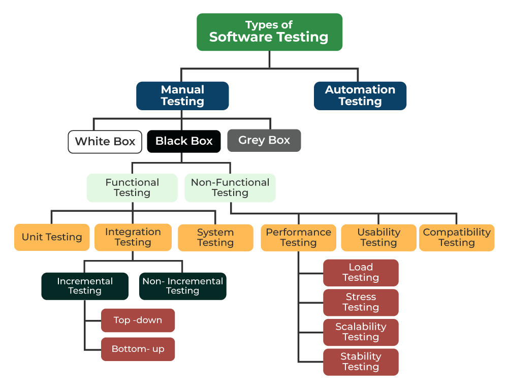
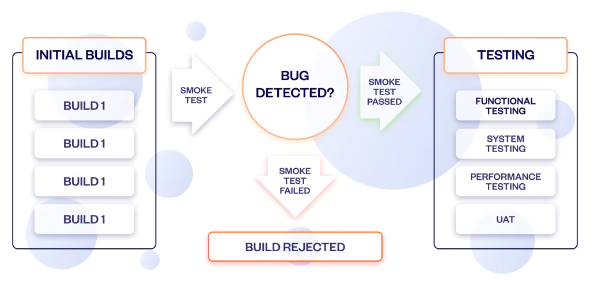
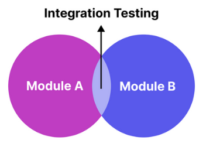

# psst - PowerShell Script Tester

**Make testing simple**: `psst network`, `psst 01`, `psst smoke` 🧪

## Overview
**psst** (PowerShell Script Tester) is a smart Pester test runner with fuzzy pattern matching and network context telemetry. No more typing full paths - just use keywords!

**v0.5.0 enhancements:**
- 🌐 **Network context telemetry**: captures public IP, VPN detection, NAT status
- 📊 **Enhanced summary**: displays operator IP, VPN/NAT in footer
- 🔒 **Formal Pester dependency**: requires Pester >= 5.7.0 (auto-installs if missing)
- 📝 **Invocation tracking**: captures full command line for audit/telemetry

Works globally once installed to your PowerShell modules path.

## Quick Start

```powershell
# Import module
Import-Module psst

# Run tests
psst                                  # Run all tests
psst foundation                       # Run foundation tests
psst smoke                            # Run smoke tests (by tag or filename)
psst integration                      # Run integration tests (by tag)
psst 01 03                            # Run multiple test groups
psst -Output Minimal                  # Run all with minimal output
```

## Installation

### Global Installation (Recommended)
Install to your PowerShell user modules directory for global access:

```powershell
# Copy module to user modules path
$modulePath = "$env:USERPROFILE\Documents\PowerShell\Modules\psst\0.5.0"
New-Item -ItemType Directory -Path $modulePath -Force
Copy-Item c:\Users\User\Documents\LogicWizards\SOLUTIONS\DevOps\SIDE-PROJECTS\tools\modules\psst\* -Destination $modulePath -Recurse -Force

# Import and verify
Import-Module psst -Force
Get-Command psst
psst -Version  # Verify 0.5.0
```

### Add to Profile (Auto-Load)
Add to your `$PROFILE` to make `psst` available in every session:

```powershell
# Add this line to $PROFILE
Import-Module psst
```

Now you can just type `psst` from any directory!

## Features

✅ **Category-Based Selection** - Run tests by type: `smoke`, `integration`, `unit`, `sanity` (v0.5.0)
✅ **Fuzzy Pattern Matching** - Type `smoke` instead of full path  
✅ **Network Context Telemetry** - Captures public IP, VPN, NAT for audit trail (v0.5.0)  
✅ **Auto-Discovery** - Finds all `*.Tests.ps1` files automatically  
✅ **Colored Summary** - Beautiful bordered test tables  
✅ **Auto-Install Pester** - Checks and installs Pester if missing  
✅ **CI/CD Friendly** - Proper exit codes and PassThru support  
✅ **Multi-Pattern** - Run multiple test groups at once  
✅ **Exclude Filters** - Skip archive folders automatically  

## Usage Examples

### Development Workflow
```powershell
# Quick smoke test before commit
psst smoke -Output Minimal

# Run cloud-dependent integration tests
psst integration                     # Only tagged Integration tests

# Test the phase you're working on
psst 03                              # Host pool tests
psst azure cost                      # Cloud cost/budget tests (OR filter on tags)

# Multiple test groups
psst foundation security cost

# Full regression
psst
```

### CI/CD Integration
```powershell
# Exit with proper code for pipeline
Import-Module psst
$exitCode = psst -Output Minimal
exit $exitCode

# Get detailed results
$result = psst -PassThru
Write-Host "Passed: $($result.PassedCount)/$($result.TotalCount)"
if ($result.FailedCount -gt 0) { exit 1 }
```

### GitHub Actions
```yaml
- name: Run Tests
  shell: pwsh
  run: |
    Import-Module psst
    $exitCode = psst
    if ($exitCode -ne 0) { exit 1 }
```

## Pattern Matching

psst supports **two ways** to categorize and run tests:

### 1. Category Tags (Recommended)
Add `-Tag` to your `Describe` blocks for flexible, multi-category tests:

```powershell
Describe "My Feature Tests" -Tag 'Integration','Phase03' {
    It "should work" { $true | Should -Be $true }
}
```

Then run by category:
```powershell
psst integration          # Runs all tests tagged 'Integration'
psst smoke                # Runs all tests tagged 'Smoke'
psst unit                 # Runs all tests tagged 'Unit'
psst phase07              # Runs all tests tagged 'Phase07'
```

 
~[image source](https://www.geeksforgeeks.org/software-testing/software-testing-basics/) (great article...)

 [What Is Smoke Testing in Software QA Testing?](https://devtorium.com/blog/what-is-smoke-testing-in-software-qa-testing/)

**Why tags?** 
- ✅ Multiple categories per file (e.g., both `Smoke` and `Phase03`)
- ✅ Selective test execution within a file
- ✅ Keep existing filename conventions
- ✅ Industry-standard Pester feature

### 2. Filename Matching
Name tests descriptively and psst will fuzzy-match:

| You Type | It Matches |
|----------|------------|
| `psst 01` | All tests in `01-*` folders |
| `psst foundation` | `foundation.Tests.ps1` |
| `psst hostpool` | `hostpool.Tests.ps1` or `*hostpool*.Tests.ps1` |
| `psst smoke` | `precommit-smoke.Tests.ps1` or tests tagged `Smoke` |
| `psst security` | Any test file with "security" in name |
| `psst cost` | `cost-budget.Tests.ps1` |
| `psst` | Everything! |

Patterns are **case-insensitive** and use **wildcard matching** (`*pattern*`).

### Psst-OOB Default Categories (Tag Mapping)
| Category | Tag | Use Case |
|----------|-----|----------|
| `smoke` | `Smoke` | Fast precommit checks (syntax, headers, basic validation) |
| `integration` | `Integration` | Cloud-dependent tests (APIs, infra) |
| `unit` | `Unit` | Isolated, fast unit tests (no external dependencies) |
| `sanity` | `Sanity` | Basic health checks after deployment |
| `cost` | `Cost` | Budget/SKU/pricing validation (pair with domain tags) |
| `azure` | `Azure` | Azure-specific tests (pair with other tags like `Cost`) |
| `other` | Exclude standard tags | Catch-all for tests outside the standard QA tags |

Notes:
- Multiple categories are combined with OR semantics. Example: `psst azure cost` runs tests tagged `Azure` OR `Cost`.
- `other` uses ExcludeTag under the hood to skip standard QA tags (`Smoke`,`Integration`,`Unit`,`Sanity`,`Cost`,`Azure`). This selects untagged or project-specific-tagged tests.
- **Fallback behavior**: If no files match by name, psst falls back to tag-only filtering and discovers all test files with matching tags.

## Parameters

### `-RootPath`
Root directory to search for tests. Defaults to current directory.

### `-Patterns`
Array of patterns to match. Defaults to `'ALL'`.
```powershell
psst 01                              # Single
psst 01 03 smoke                     # Multiple (OR logic)
```

### `-Output`
Pester verbosity: `None`, `Minimal`, `Normal`, `Detailed`, `Diagnostic`

### `-PassThru`
Return full Pester result object for programmatic use

### `-ExcludePattern`
Glob pattern to exclude (default: `'*\archive\*'`)

### `-Quiet`
Suppress custom summary table (only show Pester's built-in output)

## Troubleshooting: psst Mode Toggle

If you suspect psst's intelligence (fuzzy matching, tag filtering, telemetry) might be causing issues, you can **disable it** temporarily using the `PSST` environment variable:

```powershell
# Disable psst intelligence (pure Pester passthrough)
$env:PSST = 'OFF'
psst smoke                           # Runs with default Pester, no psst logic

# Re-enable psst intelligence
$env:PSST = 'ON'
psst smoke                           # Back to normal psst behavior

# Or inline for one-off testing
$env:PSST='OFF'; psst integration
```

**When `PSST = 'OFF'`:**
- ❌ No fuzzy pattern matching
- ❌ No tag filtering or category mapping
- ❌ No network context telemetry
- ❌ No custom summary formatting
- ✅ Pure `Invoke-Pester` on all discovered `*.Tests.ps1` files

**Visual indicator:** psst displays its mode at startup:
```
⚙️  TESTING in psst mode: ON
Invoking Extended Test Intelligence...
```

**Default:** Mode is `ON` unless explicitly set to `OFF`.

## Requirements

- PowerShell 7.0+
- Pester >= 5.7.0 (auto-installs if missing)

## Telemetry & Network Context (v0.5.0)
When `Get-NetworkContext` is available (from `common-library.ps1`), psst captures:
- **Public IP**: Operator's effective public IP address
- **VPN Detection**: Heuristic detection of VPN adapters (Cisco, GlobalProtect, WireGuard, etc.)
- **NAT Detection**: Compares local private IP vs public IP to detect NAT/PAT

Telemetry is displayed in the test summary footer:
```
  - ip:  72.90.132.210
  - nat: yes
  - vpn: detected
```

This helps troubleshoot connectivity issues and provides audit context for test runs.

## Version History
- **v0.5.0** (2025-11-14) - **Category-based testing** via Pester tags (`smoke`, `integration`, `unit`, `sanity`), network context telemetry, VPN/NAT detection, Pester >= 5.7.0 dependency
- **v0.4.0** (2025-11-04) - Rebranded to psst, removed alias, auto-install Pester, global installation ready
- **Previous** (as PesterTester) - v1.1.0, v1.0.1, v1.0.0

## Roadmap

### Planned Enhancements (C2 Priority - v0.6.0+)
- [ ] `-CI` mode: exit code only, no custom summary (for CI pipelines)
- [ ] `-PassThru` refinement: ensure full Pester result object compatibility
- [ ] Parallel test execution support (`-Parallel`)
- [ ] Watch mode: rerun tests on file changes (`-Watch`)
- [ ] ~~Test tags/categories filtering (`-Tag`, `-ExcludeTag`)~~ ✅ **SHIPPED in v0.5.0**
- [ ] Self-install command (`Install-psst`) for frictionless setup

### Future Enhancements (Nice-to-Haves)
- [ ] Test file caching for faster discovery on large repos
- [ ] Custom test ordering and grouping
- [ ] Test history and flaky test detection
- [ ] Interactive test selector (Out-GridView)
- [ ] Support for other test frameworks (PSKoans, etc.)
- [ ] PowerShell Gallery publication
- [ ] Cross-platform path handling improvements
- [ ] Better error messages for common issues

*See `TECH-DEBT-psst-Standardization.md` for standardization roadmap (replacing Invoke-Pester with psst across all deploy scripts).*

## License
MIT License - Feel free to use in your projects!

## Author
**Joe Negron** <Joe@LogicWizards.NYC>  
**Logic Wizards** <LogicWizards.NYC>

## Related Tools
- **clipd** - Clipboard directory listing tool
- More Logic Wizards tools at: https://LogicWizards.NYC

---

**Pro Tip**: Combine with `clipd` to quickly share test results!
```powershell
psst | Out-String | Set-Clipboard
```

# APPENDIX: 
## Types of QA Testing

**Quality Assurance** (QA) testing ensures that software meets specified requirements and functions as expected. Various types of QA testing are employed depending on the purpose, scope, and approach. Below are the most common types of QA testing:

**Unit Testing** focuses on testing individual components or functions of the software in isolation. It ensures that each unit works as intended before integration.

**Integration Testing** evaluates the interaction between different modules or components. It identifies issues such as data flow problems or interface mismatches when components are combined.  


**End-to-End Testing** verifies the entire application workflow from start to finish, simulating real-world user scenarios to ensure all components work together seamlessly.

**Manual Testing** involves human testers interacting with the software to identify bugs and usability issues. It is particularly useful for exploratory, ad hoc, and usability testing.

**Automation Testing** uses tools and scripts to execute test cases automatically, improving efficiency and accuracy while reducing manual effort.

**Performance Testing** assesses the application's responsiveness, stability, and scalability under various conditions, including load and stress scenarios.

**Regression Testing** ensures that recent code changes do not introduce new bugs or break existing functionality. It is often automated for efficiency.

**Compatibility Testing** verifies that the application functions correctly across different devices, browsers, operating systems, and environments.

**Accessibility Testing** evaluates whether the software is usable by individuals with disabilities, focusing on features like screen readers, keyboard navigation, and color contrast.

**Smoke Testing** checks the basic functionality of the application to determine if it is stable enough for further testing.

**Sanity Testing** validates specific functionalities after minor changes or bug fixes to ensure they work as expected.

**Box Testing**
- **White Box** examines the internal structure and logic of the code, while
- **Black Box** focuses on testing the software's functionality without knowledge of its internal workings.

**Functional Testing** ensures that the application's features work according to specified requirements, often using test cases for validation.

**Visual Testing** verifies the user interface's appearance, layout, and consistency across different screen resolutions and devices.

**User Acceptance Testing (UAT)** is the final phase where end-users validate the software to ensure it meets their requirements and expectations.

Each type of QA testing plays a crucial role in ensuring software quality, and the choice of testing depends on the project's requirements and goals.

#### Common QA Strategies:

- **Big Bang Approach:** integrates all components & tests at once.
- **Incremental Approach**: integrate & tests components in logical groups.
Incremental testing can be performed using:
- **Bottom-up Approach:** test smaller components first; then larger ones.
- **Top-down Approach:** test BIG components first from a high level; then smaller ones until you get into the weeds and/or rabbit-holes.
- **Sandwich Approach:** combination of top-down and bottom-up.